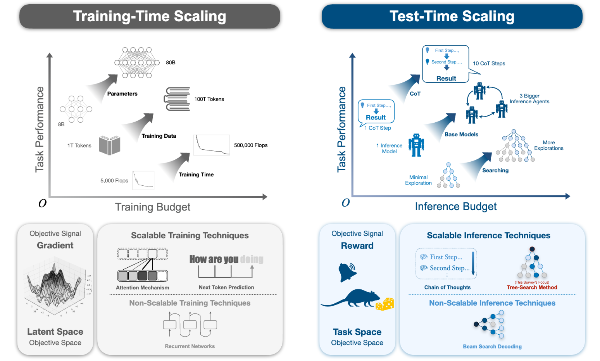
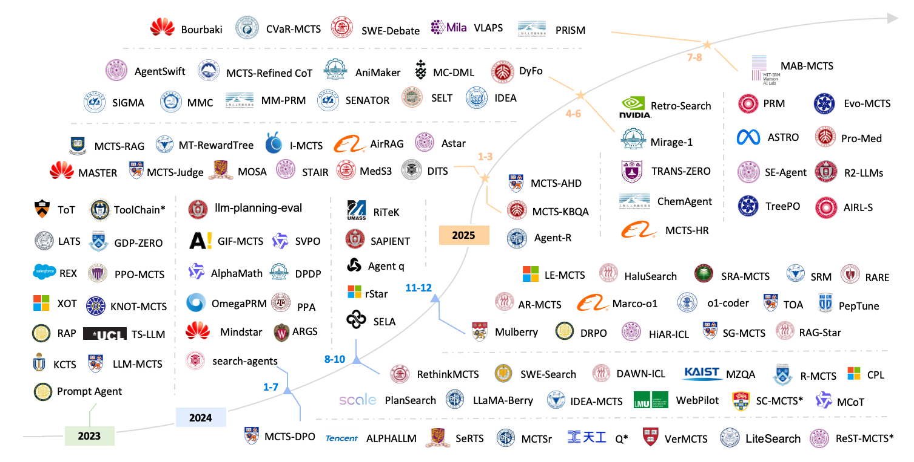
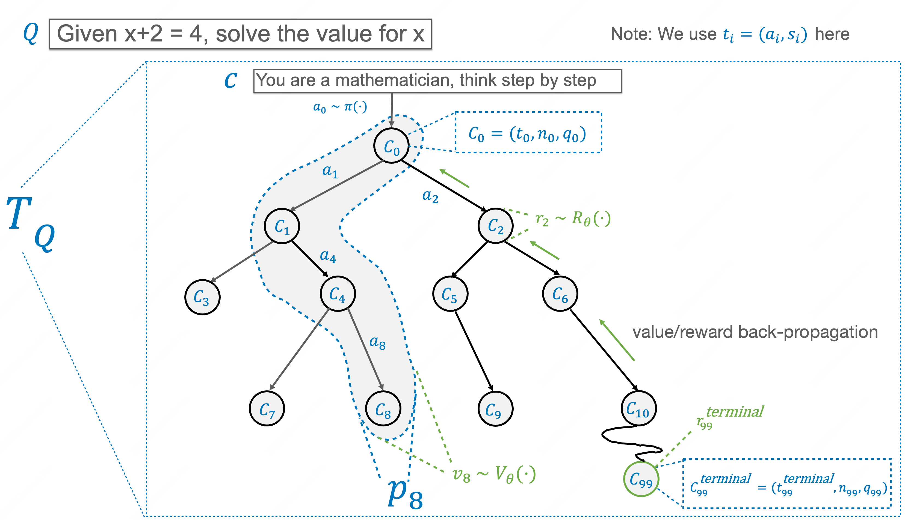

<div align="center">
  <h1>Awesome Tree Search Algorithms for LLM</h1>
  
  <br> 
  
  [](https://arxiv.org/pdf/2510.09988)
  [](https://example.com/citations)
  [](LICENSE)  


Welcome to the **"Awesome Search"** repository ！

This repository, accompanying our paper, provides **a comprehensive review** and **unified framework** for tree search-based methods, demonstrating how these algorithms are revolutionizing LLM test-time reasoning with scalable and efficient problem-solving solutions.

Dive into this repository to explore how innovative search-based methods like MCTS are reshaping reasoning capabilities in LLMs!

🔔 🔔 🔔 For more detailed information, please refer to [our paper](https://arxiv.org/pdf/2510.09988)

✉️ ➡️ 📪 If you have any questions, please feel free to contact us at:

**`{weijiaqi, yangyuejin}@pjlab.org.cn` | `xzhang23@ualberta.ca`**

<br>
  
<br><br>


</div>

## 👋 Introduction

As the scaling of large language models (LLMs) during training reaches diminishing returns, there has been a shift toward scalable test-time reasoning algorithms. Chain-of-Thought (CoT) reasoning has emerged as a promising approach, enabling intermediate reasoning steps in text space. However, traditional CoT methods suffer from **single-path exploration**, which limits their ability to fully explore complex reasoning spaces. 

To address this limitation, recent works have adopted **tree search-based reasoning frameworks**, inspired by classical search algorithms such as Depth-First Search (DFS), Breadth-First Search (BFS), and Monte Carlo Tree Search (MCTS). These methods demonstrate significant potential in balancing exploration and exploitation, enabling LLMs to efficiently solve complex tasks at test time.

 <!-- Update with the path to image '645925398' -->


This repository provides a **comprehensive framework** for tree search-based reasoning in LLMs, aiming to unify and advance the field. **Our primary contributions** include:

1. **A Unified Formalism**:  
   We propose a structured mathematical framework to analyze and compare tree search algorithms, focusing on their core mechanisms, reasoning reward formulations, and application domains. Specifically, we formalize the role of "reward" as a transient guidance signal in test-time search.

2. **A Systematic Taxonomy**:  
   We categorize existing search algorithms along three primary axes:
   - The search mechanism (e.g., DFS, BFS, MCTS)
   - The reward formulation
   - The application domain

   This taxonomy provides clarity for researchers and practitioners navigating this evolving field.

3. **A Synthesis of Applications and Future Directions**:  
   We map the primary applications of tree search reasoning, including mathematical reasoning, data generation, and optimization. Additionally, we highlight key areas for future research, such as improving general-purpose reasoning capabilities and enhancing scalability.

 <!-- Update with the path to image '645925401' -->


Our survey highlights the transformative potential of tree search-based reasoning frameworks in overcoming the limitations of traditional CoT methods. By providing a unified formalism, systematic taxonomy, and practical insights, we aim to establish a robust foundation for advancing LLM test-time reasoning.

For more details, please refer to our full paper or explore the examples and implementations provided in this repository.

## 📑 Contents

- [Part 1: MCTS for Direct Inference-Time Enhancement](#part-2-mcts-for-direct-inference-time-enhancement)
  - [General Reasoning & Problem Solving](#general-reasoning--problem-solving)
  - [Mathematical Reasoning](#mathematical-reasoning)
  - [Code Generation & Software Engineering](#code-generation--software-engineering)
  - [LLM Agents & Interactive Environments](#llm-agents--interactive-environments)
  - [Retrieval-Augmented Generation (RAG) & Knowledge-Intensive Tasks](#retrieval-augmented-generation-rag--knowledge-intensive-tasks)
  - [Multimodal Reasoning](#multimodal-reasoning)
- [Part 2: MCTS for Self-Improvement via Data Generation](#part-3-mcts-for-self-improvement-via-data-generation)
  - [Foundational Self-Improvement Frameworks](#foundational-self-improvement-frameworks)
  - [Applications in Specific Domains](#applications-in-specific-domains)
    - [General Capabilities & Alignment](#general-capabilities--alignment)
    - [Scientific & Specialized Domains](#scientific--specialized-domains)
    - [Multimodal Applications](#multimodal-applications)
- [Part 3: Advanced Topics and Hybrid Approaches](#part-4-advanced-topics-and-hybrid-approaches)
  - [Multi-Agent and Collaborative Search](#multi-agent-and-collaborative-search)
  - [Reward Model Design and Optimization](#reward-model-design-and-optimization)
  - [Search Efficiency and Dynamics](#search-efficiency-and-dynamics)

---

## Part 1: MCTS for Direct Inference-Time Enhancement

### General Reasoning & Problem Solving
<ul>
  <li>
    <i><b>Tree of Thoughts: Deliberate Problem Solving with Large Language Models</b></i>, Muralidharan, Jananee and Thomas, Tiju  
    <a href="https://arxiv.org/pdf/2305.10601" target="_blank">
      
    </a>
  </li>
  <li>
    <i><b>Reasoning with language model is planning with world model</b></i>, Hao, Shibo et al.  
    <a href="https://arxiv.org/abs/2305.14992" target="_blank">
      
    </a>
  </li>
  <li>
    <i><b>AlphaZero-Like Tree-Search can Guide Large Language Model Decoding and Training</b></i>, Feng, Xidong et al.  
    <a href="https://arxiv.org/pdf/2309.17179" target="_blank">
      
    </a>
  </li>
  <li>
    <i><b>Towards self-improvement of llms via mcts: Leveraging stepwise knowledge with curriculum preference learning</b></i>, Wang, Xiyao et al.  
    <a href="https://arxiv.org/abs/2410.06508" target="_blank">
      
    </a>
  </li>
  <li>
    <i><b>PPL-MCTS: Constrained textual generation through discriminator-guided MCTS decoding</b></i>, Chaffin, Antoine et al.  
    <a href="https://arxiv.org/pdf/2109.13582" target="_blank">
      
    </a>
  </li>
  <li>
    <i><b>Don't throw away your value model! Generating more preferable text with Value-Guided Monte-Carlo Tree Search decoding</b></i>, Liu, Jiacheng et al.  
    <a href="https://arxiv.org/pdf/2309.15028" target="_blank">
      
    </a>
  </li>
  <li>
    <i><b>Args: Alignment as reward-guided search</b></i>, Khanov, Maxim et al.  
    <a href="http://arxiv.org/pdf/2402.01694" target="_blank">
      
    </a>
  </li>
  <li>
    <i><b>When is tree search useful for llm planning? it depends on the discriminator</b></i>, Chen, Ziru et al.  
    <a href="https://arxiv.org/pdf/2402.10890" target="_blank">
      
    </a>
  </li>
  <li>
    <i><b>Interpretable contrastive monte carlo tree search reasoning</b></i>, Gao, Zitian et al.  
    <a href="https://arxiv.org/pdf/2410.01707" target="_blank">
      
    </a>
  </li>
  <li>
    <i><b>Synthetic data generation from real data sources using monte carlo tree search and large language models</b></i>, Locowic, Leonardo et al.  
    <a href="https://www.authorea.com/doi/full/10.22541/au.172660477.72210139" target="_blank">
      
    </a>
  </li>
</ul>

### Mathematical Reasoning
<ul>

  <!-- Paper_2: ReST-MCTS*: LLM Self-Training via Process Reward Guided Tree Search -->
  <li>
    <i><b>ReST-MCTS*: LLM Self-Training via Process Reward Guided Tree Search</b></i>, Zhang et al.
    <a href="https://arxiv.org/abs/2406.03816" target="_blank">
      
    </a>
  </li>

  <!-- Paper_6: Toward self-improvement of llms via imagination, searching, and criticizing. -->
  <li>
    <i><b>Toward Self-Improvement of LLMs via Imagination, Searching, and Criticizing</b></i>, Tian et al.
    <a href="https://proceedings.neurips.cc/paper_files/paper/2024/file/5e5853f35164e434015716a8c2a66543-Paper-Conference.pdf" target="_blank">
      
    </a>
  </li>

  <!-- Paper_7: Monte carlo tree search boosts reasoning via iterative preference learning -->
  <li>
    <i><b>Monte Carlo Tree Search Boosts Reasoning via Iterative Preference Learning</b></i>, Xie et al.
    <a href="https://arxiv.org/pdf/2405.00451" target="_blank">
      
    </a>
  </li>

  <!-- Paper_8: Accessing GPT-4 level Mathematical Olympiad Solutions via Monte Carlo Tree Self-refine with LLaMa-3 8B -->
  <li>
    <i><b>Accessing GPT-4 Level Mathematical Olympiad Solutions via Monte Carlo Tree Self-Refine with LLaMa-3 8B</b></i>, Zhang et al.
    <a href="https://arxiv.org/pdf/2406.07394" target="_blank">
      
    </a>
  </li>

  <!-- Paper_32: No train still gain. unleash mathematical reasoning of large language models with monte carlo tree search guided by energy function -->
  <li>
    <i><b>No Train Still Gain. Unleash Mathematical Reasoning of Large Language Models with Monte Carlo Tree Search Guided by Energy Function</b></i>, Xu et al.
    <a href="https://arxiv.org/pdf/2309.03224" target="_blank">
      
    </a>
  </li>

  <!-- Paper_35: Mutual Reasoning Makes Smaller LLMs Stronger Problem-Solvers -->
  <li>
    <i><b>Mutual Reasoning Makes Smaller LLMs Stronger Problem-Solvers</b></i>, Qi et al.
    <a href="https://arxiv.org/pdf/2408.06195" target="_blank">
      
    </a>
  </li>

  <!-- Paper_36: AlphaMath Almost Zero: Process Supervision without Process -->
  <li>
    <i><b>AlphaMath Almost Zero: Process Supervision Without Process</b></i>, Chen et al.
    <a href="https://proceedings.neurips.cc/paper_files/paper/2024/file/30dfe47a3ccbee68cffa0c19ccb1bc00-Paper-Conference.pdf" target="_blank">
      
    </a>
  </li>

  <!-- Paper_41: LiteSearch: Efficacious Tree Search for LLM -->
  <li>
    <i><b>LiteSearch: Efficacious Tree Search for LLM</b></i>, Wang et al.
    <a href="https://arxiv.org/pdf/2407.00320" target="_blank">
      
    </a>
  </li>

  <!-- Paper_48: Markov Chain of Thought for Efficient Mathematical Reasoning -->
  <li>
    <i><b>Markov Chain of Thought for Efficient Mathematical Reasoning</b></i>, Yang et al.
    <a href="https://arxiv.org/pdf/2410.17635" target="_blank">
      
    </a>
  </li>

  <!-- Paper_52: OVM, Outcome-supervised Value Models for Planning in Mathematical Reasoning -->
  <li>
    <i><b>OVM, Outcome-Supervised Value Models for Planning in Mathematical Reasoning</b></i>, Yu et al.
    <a href="https://arxiv.org/pdf/2311.09724" target="_blank">
      
    </a>
  </li>

  <!-- Paper_53: Mindstar: Enhancing math reasoning in pre-trained llms at inference time -->
  <li>
    <i><b>MindStar: Enhancing Math Reasoning in Pre-Trained LLMs at Inference Time</b></i>, Kang et al.
    <a href="https://arxiv.org/pdf/2405.16265" target="_blank">
      
    </a>
  </li>

  <!-- Paper_57: LLaMA-Berry: Pairwise Optimization for Olympiad-level Mathematical Reasoning via O1-like Monte Carlo Tree Search -->
  <li>
    <i><b>LLaMA-Berry: Pairwise Optimization for Olympiad-Level Mathematical Reasoning via O1-like Monte Carlo Tree Search</b></i>, Zhang et al.
    <a href="https://aclanthology.org/2025.naacl-long.375.pdf" target="_blank">
      
    </a>
  </li>

  <!-- Paper_59: Beyond Examples: High-level Automated Reasoning Paradigm in In-Context Learning via MCTS -->
  <li>
    <i><b>Beyond Examples: High-Level Automated Reasoning Paradigm in In-Context Learning via MCTS</b></i>, Wu et al.
    <a href="https://arxiv.org/pdf/2411.18478" target="_blank">
      
    </a>
  </li>

  <!-- Paper_66: BoostStep: Boosting mathematical capability of Large Language Models via improved single-step reasoning -->
  <li>
    <i><b>BoostStep: Boosting Mathematical Capability of Large Language Models via Improved Single-Step Reasoning</b></i>, Zhang et al.
    <a href="https://arxiv.org/pdf/2501.03226" target="_blank">
      
    </a>
  </li>

  <!-- Paper_69: Step-level Value Preference Optimization for Mathematical Reasoning -->
  <li>
    <i><b>Step-Level Value Preference Optimization for Mathematical Reasoning</b></i>, Chen et al.
    <a href="https://arxiv.org/pdf/2406.10858" target="_blank">
      
    </a>
  </li>

  <!-- Paper_70: Improve Mathematical Reasoning in Language Models by Automated Process Supervision -->
  <li>
    <i><b>Improve Mathematical Reasoning in Language Models by Automated Process Supervision</b></i>, Luo et al.
    <a href="https://arxiv.org/pdf/2406.06592" target="_blank">
      
    </a>
  </li>

  <!-- Paper_79: What Are Step-Level Reward Models Rewarding? Counterintuitive Findings from MCTS-Boosted Mathematical Reasoning -->
  <li>
    <i><b>What Are Step-Level Reward Models Rewarding? Counterintuitive Findings from MCTS-Boosted Mathematical Reasoning</b></i>, Ma et al.
    <a href="https://ojs.aaai.org/index.php/AAAI/article/view/34663" target="_blank">
      
    </a>
  </li>

  <!-- Paper_80: Ensembling Large Language Models with Process Reward-Guided Tree Search for Better Complex Reasoning -->
  <li>
    <i><b>Ensembling Large Language Models with Process Reward-Guided Tree Search for Better Complex Reasoning</b></i>, Park et al.
    <a href="https://arxiv.org/pdf/2412.15797" target="_blank">
      
    </a>
  </li>

  <!-- Paper_91: rStar-Math: Small LLMs Can Master Math Reasoning with Self-Evolved Deep Thinking -->
  <li>
    <i><b>rStar-Math: Small LLMs Can Master Math Reasoning with Self-Evolved Deep Thinking</b></i>, Guan et al.
    <a href="https://arxiv.org/pdf/2501.04519" target="_blank">
      
    </a>
  </li>

  <!-- Paper_15 (Jan-Apr 2025): Leveraging Constrained Monte Carlo Tree Search to Generate Reliable Long Chain-of-Thought for Mathematical Reasoning -->
  <li>
    <i><b>Leveraging Constrained Monte Carlo Tree Search to Generate Reliable Long Chain-of-Thought for Mathematical Reasoning</b></i>, Lin et al.
    <a href="https://arxiv.org/abs/2502.11169" target="_blank">
      
    </a>
  </li>

</ul>

### Code Generation & Software Engineering
<ul>
  <!-- Paper_13: Planning with Large Language Models for Code Generation -->
  <li>
    <i><b>Planning With Large Language Models for Code Generation</b></i>, Zhang et al.
    <a href="https://arxiv.org/pdf/2303.05510" target="_blank">
      
    </a>
  </li>

  <!-- Paper_17: Make Every Move Count: LLM-based High-Quality RTL Code Generation Using MCTS -->
  <li>
    <i><b>Make Every Move Count: LLM-Based High-Quality RTL Code Generation Using MCTS</b></i>, DeLorenzo et al.
    <a href="https://arxiv.org/pdf/2402.03289" target="_blank">
      
    </a>
  </li>

  <!-- Paper_20: RethinkMCTS: Refining Erroneous Thoughts in Monte Carlo Tree Search for Code Generation -->
  <li>
    <i><b>RethinkMCTS: Refining Erroneous Thoughts in Monte Carlo Tree Search for Code Generation</b></i>, Li et al.
    <a href="https://arxiv.org/pdf/2409.09584" target="_blank">
      
    </a>
  </li>

  <!-- Paper_22 & 27: VerMCTS: Synthesizing Multi-Step Programs using a Verifier, a Large Language Model, and Tree Search -->
  <li>
    <i><b>VerMCTS: Synthesizing Multi-Step Programs Using a Verifier, a Large Language Model, and Tree Search</b></i>, Brandfonbrener et al.
    <a href="https://arxiv.org/pdf/2402.08147" target="_blank">
      
    </a>
  </li>

  <!-- Paper_33: Generating Code World Models with Large Language Models Guided by Monte Carlo Tree Search -->
  <li>
    <i><b>Generating Code World Models With Large Language Models Guided by Monte Carlo Tree Search</b></i>, Dainese et al.
    <a href="https://arxiv.org/abs/2405.15383" target="_blank">
      
    </a>
  </li>

  <!-- Paper_56: Planning In Natural Language Improves LLM Search For Code Generation -->
  <li>
    <i><b>Planning In Natural Language Improves LLM Search For Code Generation</b></i>, Wang et al.
    <a href="https://arxiv.org/pdf/2409.03733" target="_blank">
      
    </a>
  </li>

  <!-- Paper_58: o1-Coder: an o1 Replication for Coding -->
  <li>
    <i><b>O1-Coder: An O1 Replication for Coding</b></i>, Zhang et al.
    <a href="https://arxiv.org/pdf/2412.00154" target="_blank">
      
    </a>
  </li>

  <!-- Paper_60 & 61: SRA-MCTS: Self-driven Reasoning Augmentation with Monte Carlo Tree Search for Code Generation -->
  <li>
    <i><b>SRA-MCTS: Self-Driven Reasoning Augmentation With Monte Carlo Tree Search for Code Generation</b></i>, Xu et al.
    <a href="https://arxiv.org/pdf/2411.11053" target="_blank">
      
    </a>
  </li>

  <!-- Paper_62 & 74: SWE-Search: Enhancing Software Agents with Monte Carlo Tree Search and Iterative Refinement -->
  <li>
    <i><b>SWE-Search: Enhancing Software Agents With Monte Carlo Tree Search and Iterative Refinement</b></i>, Antoniades et al.
    <a href="https://arxiv.org/pdf/2410.20285" target="_blank">
      
    </a>
  </li>

  <!-- Paper_77: PepTune: De Novo Generation of Therapeutic Peptides with Multi-Objective-Guided Discrete Diffusion -->
  <li>
    <i><b>PepTune: De Novo Generation of Therapeutic Peptides With Multi-Objective-Guided Discrete Diffusion</b></i>, Tang et al.
    <a href="https://pmc.ncbi.nlm.nih.gov/articles/PMC11703324/" target="_blank">
      
    </a>
  </li>

  <!-- Paper_14 (Jan-Apr 2025): BFS-Prover: Scalable Best-First Tree Search for LLM-based Automatic Theorem Proving -->
  <li>
    <i><b>BFS-Prover: Scalable Best-First Tree Search for LLM-Based Automatic Theorem Proving</b></i>, Xin et al.
    <a href="https://arxiv.org/pdf/2502.03438" target="_blank">
      
    </a>
  </li>

  <!-- Paper_18 (Jan-Apr 2025): MCTS-Judge: Test-Time Scaling in LLM-as-a-Judge for Code Correctness Evaluation -->
  <li>
    <i><b>MCTS-Judge: Test-Time Scaling in LLM-as-a-Judge for Code Correctness Evaluation</b></i>, Wang et al.
    <a href="https://arxiv.org/pdf/2502.12468" target="_blank">
      
    </a>
  </li>

  <!-- Paper_15 (May-Aug 2025): SWE-Debate: Competitive Multi-Agent Debate for Software Issue Resolution -->
  <li>
    <i><b>SWE-Debate: Competitive Multi-Agent Debate for Software Issue Resolution</b></i>, Li et al.
    <a href="https://arxiv.org/pdf/2507.23348" target="_blank">
      
    </a>
  </li>

  <!-- Paper_22 (May-Aug 2025): Bourbaki: Self-Generated and Goal-Conditioned MDPs for Theorem Proving -->
  <li>
    <i><b>Bourbaki: Self-Generated and Goal-Conditioned MDPs for Theorem Proving</b></i>, Zimmer et al.
    <a href="https://arxiv.org/pdf/2507.02726" target="_blank">
      
    </a>
  </li>

  <!-- Paper_24 (May-Aug 2025): APRMCTS: Improving LLM-based Automated Program Repair with Iterative Tree Search -->
  <li>
    <i><b>APRMCTS: Improving LLM-Based Automated Program Repair With Iterative Tree Search</b></i>, Hu et al.
    <a href="https://arxiv.org/pdf/2507.01827" target="_blank">
      
    </a>
  </li>

  <!-- Paper_32 (May-Aug 2025): MCTS-Refined CoT: High-Quality Fine-Tuning Data for LLM-Based Repository Issue Resolution -->
  <li>
    <i><b>MCTS-Refined CoT: High-Quality Fine-Tuning Data for LLM-Based Repository Issue Resolution</b></i>, Wang et al.
    <a href="https://arxiv.org/pdf/2506.12728" target="_blank">
      
    </a>
  </li>
</ul>

### LLM Agents & Interactive Environments
<ul>
  <!-- Paper_9: TREE SEARCH FOR LANGUAGE MODEL AGENTS -->
  <li>
    <i><b>Tree Search for Language Model Agents</b></i>, Koh et al.
    <a href="https://arxiv.org/pdf/2407.01476" target="_blank">
      
    </a>
  </li>

  <!-- Paper_10: Enhancing Decision-Making for LLM Agents via Step-Level Q-Value Models -->
  <li>
    <i><b>Enhancing Decision-Making for LLM Agents via Step-Level Q-Value Models</b></i>, Zhai et al.
    <a href="https://ojs.aaai.org/index.php/AAAI/article/view/34924" target="_blank">
      
    </a>
  </li>

  <!-- Paper_11: Large Language Models as Commonsense Knowledge for Large-Scale Task Planning -->
  <li>
    <i><b>Large Language Models as Commonsense Knowledge for Large-Scale Task Planning</b></i>, Zhao et al.
    <a href="https://proceedings.neurips.cc/paper_files/paper/2023/file/65a39213d7d0e1eb5d192aa77e77eeb7-Paper-Conference.pdf" target="_blank">
      
    </a>
  </li>

  <!-- Paper_19: Can Large Language Models Play Games? A Case Study of A Self-Play Approach -->
  <li>
    <i><b>Can Large Language Models Play Games? A Case Study of A Self-Play Approach</b></i>, Guo et al.
    <a href="http://arxiv.org/pdf/2403.05632" target="_blank">
      
    </a>
  </li>

  <!-- Paper_25: Planning with Large Language Models for Conversational Agents -->
  <li>
    <i><b>Planning with Large Language Models for Conversational Agents</b></i>, Li et al.
    <a href="https://papers.cool/arxiv/search?highlight=1&query=Planning+with+Large+Language+Models+for+Conversational+Agents&show=200" target="_blank">
      
    </a>
  </li>

  <!-- Paper_26: Improving Autonomous AI Agents with Reflective Tree Search and Self-Learning -->
  <li>
    <i><b>Improving Autonomous AI Agents with Reflective Tree Search and Self-Learning</b></i>, Yu et al.
    
  </li>

  <!-- Paper_29: REX: Rapid Exploration and eXploitation for AI Agents -->
  <li>
    <i><b>REX: Rapid Exploration and eXploitation for AI Agents</b></i>, Murthy et al.
    <a href="https://openreview.net/forum?id=8TAGx549Ns" target="_blank">
      
    </a>
  </li>

  <!-- Paper_30 & 64: SELA: Tree-Search Enhanced LLM Agents for Automated Machine Learning -->
  <li>
    <i><b>SELA: Tree-Search Enhanced LLM Agents for Automated Machine Learning</b></i>, Chi et al.
    <a href="https://arxiv.org/pdf/2410.17238" target="_blank">
      
    </a>
  </li>

  <!-- Paper_31: Toolchain: Efficient action space navigation in large language models with a* search -->
  <li>
    <i><b>ToolChain*: Efficient Action Space Navigation in Large Language Models with A* Search</b></i>, Zhuang et al.
    <a href="https://arxiv.org/pdf/2310.13227" target="_blank">
      
    </a>
  </li>

  <!-- Paper_34: Agent q: Advanced reasoning and learning for autonomous ai agents -->
  <li>
    <i><b>Agent Q: Advanced Reasoning and Learning for Autonomous AI Agents</b></i>, Putta et al.
    <a href="https://arxiv.org/pdf/2408.07199" target="_blank">
      
    </a>
  </li>

  <!-- Paper_37: Information Directed Tree Search: Reasoning and Planning with Language Agents -->
  <li>
    <i><b>Information Directed Tree Search: Reasoning and Planning with Language Agents</b></i>, Chandak et al.
    <a href="https://openreview.net/pdf?id=turWYO1w2Q" target="_blank">
      
    </a>
  </li>

  <!-- Paper_44: LLM-A*: Large Language Model Enhanced Incremental Heuristic Search on Path Planning -->
  <li>
    <i><b>LLM-A*: Large Language Model Enhanced Incremental Heuristic Search on Path Planning</b></i>, Meng et al.
    <a href="https://arxiv.org/pdf/2407.02511" target="_blank">
      
    </a>
  </li>

  <!-- Paper_46: Strategist: Learning Strategic Skills by LLMs via Bi-Level Tree Search -->
  <li>
    <i><b>Strategist: Learning Strategic Skills by LLMs via Bi-Level Tree Search</b></i>, Light et al.
    <a href="https://arxiv.org/pdf/2408.10635" target="_blank">
      
    </a>
  </li>

  <!-- Paper_47: Language agent tree search unifies reasoning acting and planning in language models -->
  <li>
    <i><b>Language Agent Tree Search Unifies Reasoning Acting and Planning in Language Models</b></i>, Zhou et al.
    <a href="https://arxiv.org/pdf/2310.04406" target="_blank">
      
    </a>
  </li>

  <!-- Paper_78: Multi-Agent Sampling: Scaling Inference Compute for Data Synthesis with Tree Search-Based Agentic Collaboration -->
  <li>
    <i><b>Multi-Agent Sampling: Scaling Inference Compute for Data Synthesis with Tree Search-Based Agentic Collaboration</b></i>, Ye et al.
    <a href="https://arxiv.org/pdf/2412.17061" target="_blank">
      
    </a>
  </li>

  <!-- Paper_84: SAPIENT: Mastering Multi-turn Conversational Recommendation with Strategic Planning and Monte Carlo Tree Search -->
  <li>
    <i><b>SAPIENT: Mastering Multi-Turn Conversational Recommendation with Strategic Planning and Monte Carlo Tree Search</b></i>, Du et al.
    <a href="https://arxiv.org/pdf/2410.09580" target="_blank">
      
    </a>
  </li>

  <!-- Paper_85: WebPilot: A Versatile and Autonomous Multi-Agent System for Web Task Execution with Strategic Exploration -->
  <li>
    <i><b>WebPilot: A Versatile and Autonomous Multi-Agent System for Web Task Execution with Strategic Exploration</b></i>, Zhang et al.
    <a href="https://ojs.aaai.org/index.php/AAAI/article/view/34505" target="_blank">
      
    </a>
  </li>

  <!-- Paper_86: A Training Data Recipe to Accelerate A* Search with Language Models -->
  <li>
    <i><b>A Training Data Recipe to Accelerate A* Search with Language Models</b></i>, Gupta et al.
    <a href="https://arxiv.org/pdf/2407.09985" target="_blank">
      
    </a>
  </li>

  <!-- Paper_87: Planning Like Human: A Dual-process Framework for Dialogue Planning -->
  <li>
    <i><b>Planning Like Human: A Dual-Process Framework for Dialogue Planning</b></i>, He et al.
    <a href="https://arxiv.org/pdf/2406.05374" target="_blank">
      
    </a>
  </li>

  <!-- Paper_90: Prompt-Based Monte-Carlo Tree Search for Goal-Oriented Dialogue Policy Planning -->
  <li>
    <i><b>Prompt-Based Monte-Carlo Tree Search for Goal-Oriented Dialogue Policy Planning</b></i>, Yu et al.
    <a href="https://arxiv.org/pdf/2305.13660" target="_blank">
      
    </a>
  </li>

  <!-- Paper_1 (Jan-Apr 2025): Monte Carlo Tree Search for Comprehensive Exploration in LLM-Based Automatic Heuristic Design -->
  <li>
    <i><b>Monte Carlo Tree Search for Comprehensive Exploration in LLM-Based Automatic Heuristic Design</b></i>, Zheng et al.
    <a href="https://arxiv.org/pdf/2501.08603" target="_blank">
      
    </a>
  </li>

  <!-- Paper_4 (Jan-Apr 2025): Agent-R: Training Language Model Agents to Reflect via Iterative Self-Training -->
  <li>
    <i><b>Agent-R: Training Language Model Agents to Reflect via Iterative Self-Training</b></i>, Yuan et al.
    <a href="https://arxiv.org/pdf/2501.11425" target="_blank">
      
    </a>
  </li>

  <!-- Paper_6 (Jan-Apr 2025): MASTER: A Multi-Agent System with LLM Specialized MCTS -->
  <li>
    <i><b>MASTER: A Multi-Agent System with LLM Specialized MCTS</b></i>, Gan et al.
    <a href="https://arxiv.org/pdf/2501.14304" target="_blank">
      
    </a>
  </li>

  <!-- Paper_9 (Jan-Apr 2025): Efficient Multi-Agent System Training with Data Influence-Oriented Tree Search -->
  <li>
    <i><b>Efficient Multi-Agent System Training with Data Influence-Oriented Tree Search</b></i>, Shi et al.
    <a href="https://arxiv.org/pdf/2502.00955" target="_blank">
      
    </a>
  </li>

  <!-- Paper_13 (May-Aug 2025): SE-Agent: Self-Evolution Trajectory Optimization in Multi-Step Reasoning with LLM-Based Agents -->
  <li>
    <i><b>SE-Agent: Self-Evolution Trajectory Optimization in Multi-Step Reasoning with LLM-Based Agents</b></i>, Lin et al.
    <a href="https://arxiv.org/pdf/2508.02085" target="_blank">
      
    </a>
  </li>

  <!-- Paper_21 (May-Aug 2025): WebSynthesis: World-Model-Guided MCTS for Efficient WebUI-Trajectory Synthesis -->
  <li>
    <i><b>WebSynthesis: World-Model-Guided MCTS for Efficient WebUI-Trajectory Synthesis</b></i>, Gao et al.
    <a href="https://arxiv.org/pdf/2507.04370" target="_blank">
      
    </a>
  </li>

  <!-- Paper_35 (May-Aug 2025): Mirage-1: Augmenting and Updating GUI Agent with Hierarchical Multimodal Skills -->
  <li>
    <i><b>Mirage-1: Augmenting and Updating GUI Agent with Hierarchical Multimodal Skills</b></i>, Xie et al.
    <a href="https://arxiv.org/pdf/2506.10387" target="_blank">
      
    </a>
  </li>

  <!-- Paper_41 (May-Aug 2025): AgentSwift: Efficient LLM Agent Design via Value-guided Hierarchical Search -->
  <li>
    <i><b>AgentSwift: Efficient LLM Agent Design via Value-Guided Hierarchical Search</b></i>, Li et al.
    <a href="https://arxiv.org/pdf/2506.06017" target="_blank">
      
    </a>
  </li>

  <!-- Paper_49 (May-Aug 2025): HALO: Hierarchical Autonomous Logic-Oriented Orchestration for Multi-Agent LLM Systems -->
  <li>
    <i><b>HALO: Hierarchical Autonomous Logic-Oriented Orchestration for Multi-Agent LLM Systems</b></i>, Hou et al.
    <a href="https://arxiv.org/pdf/2505.13516" target="_blank">
      
    </a>
  </li>

  <!-- Paper_52 (May-Aug 2025): AgentXploit: End-to-End Redteaming of Black-Box AI Agents -->
  <li>
    <i><b>AgentXploit: End-to-End Redteaming of Black-Box AI Agents</b></i>, Wang et al.
    <a href="https://ui.adsabs.harvard.edu/abs/2025arXiv250505849W/abstract" target="_blank">
      
    </a>
  </li>
</ul>

### Retrieval-Augmented Generation (RAG) & Knowledge-Intensive Tasks
<ul>
  <!-- Paper_23: A novel approach to optimize large language models for named entity matching with monte carlo tree search -->
  <li>
    <i><b>A Novel Approach to Optimize Large Language Models for Named Entity Matching with Monte Carlo Tree Search</b></i>, Volkova et al.
    <a href="https://d197for5662m48.cloudfront.net/documents/publicationstatus/224148/preprint_pdf/157c3392749a8fb55e09e2a452b5c1fb.pdf" target="_blank">
      
    </a>
  </li>

  <!-- Paper_28: KNOT-MCTS: An Effective Approach to Addressing Hallucinations in Generative Language Modeling for Question Answering -->
  <li>
    <i><b>KNOT-MCTS: An Effective Approach to Addressing Hallucinations in Generative Language Modeling for Question Answering</b></i>, Wu et al.
    <a href="https://aclanthology.org/2023.rocling-1.26.pdf" target="_blank">
      
    </a>
  </li>

  <!-- Paper_43: Search-in-the-Chain: Interactively Enhancing Large Language Models with Search for Knowledge-intensive Tasks -->
  <li>
    <i><b>Search-in-the-Chain: Interactively Enhancing Large Language Models with Search for Knowledge-Intensive Tasks</b></i>, Xu et al.
    <a href="https://dl.acm.org/doi/pdf/10.1145/3589334.3645363" target="_blank">
      
    </a>
  </li>

  <!-- Paper_45: Monte carlo thought search: Large language model querying for complex scientific reasoning in catalyst design -->
  <li>
    <i><b>Monte Carlo Thought Search: Large Language Model Querying for Complex Scientific Reasoning in Catalyst Design</b></i>, Sprueill et al.
    <a href="https://arxiv.org/pdf/2310.14420" target="_blank">
      
    </a>
  </li>

  <!-- Paper_67: RAGStar: Enhancing Deliberative Reasoning with Retrieval Augmented Verification and Refinement -->
  <li>
    <i><b>RAG-Star: Enhancing Deliberative Reasoning with Retrieval Augmented Verification and Refinement</b></i>, Jiang et al.
    <a href="https://arxiv.org/pdf/2412.12881" target="_blank">
      
    </a>
  </li>

  <!-- Paper_72: RARE: Retrieval-Augmented Reasoning Enhancement for Large Language Models -->
  <li>
    <i><b>RARE: Retrieval-Augmented Reasoning Enhancement for Large Language Models</b></i>, Tran et al.
    <a href="https://arxiv.org/pdf/2412.02830" target="_blank">
      
    </a>
  </li>

  <!-- Paper_73: CORAG: A Cost-Constrained Retrieval Optimization System for Retrieval-Augmented Generation -->
  <li>
    <i><b>CORAG: A Cost-Constrained Retrieval Optimization System for Retrieval-Augmented Generation</b></i>, Wang et al.
    <a href="https://arxiv.org/pdf/2411.00744" target="_blank">
      
    </a>
  </li>

  <!-- Paper_81: Think&Cite: Improving Attributed Text Generation with Self-Guided Tree Search and Progress Reward Modeling -->
  <li>
    <i><b>Think&Cite: Improving Attributed Text Generation with Self-Guided Tree Search and Progress Reward Modeling</b></i>, Li et al.
    <a href="https://arxiv.org/abs/2412.14860" target="_blank">
      
    </a>
  </li>

  <!-- Paper_82: RiTeK: A Dataset for Large Language Models Complex Reasoning over Textual Knowledge Graphs -->
  <li>
    <i><b>RiTeK: A Dataset for Large Language Models Complex Reasoning Over Textual Knowledge Graphs</b></i>, Huang et al.
    <a href="https://arxiv.org/pdf/2410.13987" target="_blank">
      
    </a>
  </li>

  <!-- Paper_89: KCTS: Knowledge-Constrained Tree Search Decoding with Token-Level Hallucination Detection -->
  <li>
    <i><b>KCTS: Knowledge-Constrained Tree Search Decoding with Token-Level Hallucination Detection</b></i>, Choi et al.
    <a href="https://arxiv.org/pdf/2310.09044" target="_blank">
      
    </a>
  </li>

  <!-- Paper_2 (Jan-Apr 2025): AirRAG: Activating Intrinsic Reasoning for Retrieval Augmented Generation via Tree-based Search -->
  <li>
    <i><b>AirRAG: Activating Intrinsic Reasoning for Retrieval Augmented Generation Using Tree-Based Search</b></i>, Feng et al.
    <a href="https://arxiv.org/pdf/2501.10053" target="_blank">
      
    </a>
  </li>

  <!-- Paper_5 (Jan-Apr 2025): MedS3: Towards Medical Small Language Models with Self-Evolved Slow Thinking -->
  <li>
    <i><b>MedS3: Towards Medical Small Language Models with Self-Evolved Slow Thinking</b></i>, Jiang et al.
    <a href="https://arxiv.org/pdf/2501.12051" target="_blank">
      
    </a>
  </li>

  <!-- Paper_8 (Jan-Apr 2025): KBQA-o1: Agentic Knowledge Base Question Answering with Monte Carlo Tree Search -->
  <li>
    <i><b>KBQA-o1: Agentic Knowledge Base Question Answering with Monte Carlo Tree Search</b></i>, Luo et al.
    <a href="https://arxiv.org/pdf/2501.17104" target="_blank">
      
    </a>
  </li>

  <!-- Paper_19 (Jan-Apr 2025): MCTS-KBQA: Monte Carlo Tree Search for Knowledge Base Question Answering -->
  <li>
    <i><b>MCTS-KBQA: Monte Carlo Tree Search for Knowledge Base Question Answering</b></i>, Xiong et al.
    <a href="https://arxiv.org/pdf/2502.13428" target="_blank">
      
    </a>
  </li>

  <!-- Paper_19 (May-Aug 2025): Enhancing Test-Time Scaling of Large Language Models with Hierarchical Retrieval-Augmented MCTS -->
  <li>
    <i><b>Enhancing Test-Time Scaling of Large Language Models with Hierarchical Retrieval-Augmented MCTS</b></i>, Dou et al.
    <a href="https://arxiv.org/pdf/2507.05557" target="_blank">
      
    </a>
  </li>

  <!-- Paper_31 (May-Aug 2025): MCTS-RAG: Enhancing Retrieval-Augmented Generation with Monte Carlo Tree Search -->
  <li>
    <i><b>MCTS-RAG: Enhancing Retrieval-Augmented Generation with Monte Carlo Tree Search</b></i>, Hu et al.
    <a href="https://arxiv.org/pdf/2503.20757" target="_blank">
      
    </a>
  </li>

  <!-- Paper_42 (May-Aug 2025): Toward Structured Knowledge Reasoning: Contrastive Retrieval-Augmented Generation on Experience -->
  <li>
    <i><b>Toward Structured Knowledge Reasoning: Contrastive Retrieval-Augmented Generation on Experience</b></i>, Gu et al.
    <a href="https://arxiv.org/pdf/2506.00842" target="_blank">
      
    </a>
  </li>

  <!-- Paper_46 (May-Aug 2025): FREESON: Retriever-Free Retrieval-Augmented Reasoning via Corpus-Traversing MCTS -->
  <li>
    <i><b>FREESON: Retriever-Free Retrieval-Augmented Reasoning via Corpus-Traversing MCTS</b></i>, Kim et al.
    <a href="https://arxiv.org/pdf/2505.16409" target="_blank">
      
    </a>
  </li>

  <!-- Paper_51 (May-Aug 2025): Structural Entropy Guided Agent for Detecting and Repairing Knowledge Deficiencies in LLMs -->
  <li>
    <i><b>Structural Entropy Guided Agent for Detecting and Repairing Knowledge Deficiencies in LLMs</b></i>, Wei et al.
    <a href="https://arxiv.org/pdf/2505.07184" target="_blank">
      
    </a>
  </li>
</ul>

### Multimodal Reasoning
<ul>
  <li>
    <i><b>Mulberry: Empowering mllm with o1-like reasoning and reflection via collective monte carlo tree search</b></i>, Yao, Huanjin et al.
    <a href="https://arxiv.org/pdf/2412.18319" target="_blank">
      
    </a>
  </li>
  <li>
    <i><b>Progressive multimodal reasoning via active retrieval</b></i>, Dong, Guanting et al.
    <a href="https://arxiv.org/pdf/2412.14835" target="_blank">
      
    </a>
  </li>
  <li>
    <i><b>Boosting multimodal reasoning with mcts-automated structured thinking</b></i>, Wu, Jinyang et al.
    <a href="https://arxiv.org/abs/2502.02339" target="_blank">
      
    </a>
  </li>
  <li>
    <i><b>MMC: Iterative Refinement of VLM Reasoning via MCTS-based Multimodal Critique</b></i>, Liu, Shuhang et al.
    <a href="https://arxiv.org/pdf/2504.11009" target="_blank">
      
    </a>
  </li>
  <li>
    <i><b>Dyfo: A training-free dynamic focus visual search for enhancing lmms in fine-grained visual understanding</b></i>, Li, Geng et al.
    <a href="https://openaccess.thecvf.com/content/CVPR2025/papers/Li_DyFo_A_Training-Free_Dynamic_Focus_Visual_Search_for_Enhancing_LMMs_CVPR_2025_paper.pdf" target="_blank">
      
    </a>
  </li>
  <li>
    <i><b>MM-PRM: Enhancing Multimodal Mathematical Reasoning with Scalable Step-Level Supervision</b></i>, Du, Lingxiao et al.
    <a href="https://arxiv.org/pdf/2505.13427" target="_blank">
      
    </a>
  </li>
</ul>

---

## Part 2: MCTS for Self-Improvement via Data Generation

### Foundational Self-Improvement Frameworks
<ul>
  <!-- Paper_4: Alphazero-like tree-search can guide large language model decoding and training -->
  <li>
    <i><b>AlphaZero-Like Tree-Search Can Guide Large Language Model Decoding and Training</b></i>, Feng et al.
    <a href="https://arxiv.org/pdf/2309.17179" target="_blank">
      
    </a>
  </li>

  <!-- Paper_6: Toward self-improvement of llms via imagination, searching, and criticizing -->
  <li>
    <i><b>Toward Self-Improvement of LLMs via Imagination, Searching, and Criticizing</b></i>, Tian et al.
    <a href="https://proceedings.neurips.cc/paper_files/paper/2024/file/5e5853f35164e434015716a8c2a66543-Paper-Conference.pdf" target="_blank">
      
    </a>
  </li>

  <!-- Paper_7: Monte carlo tree search boosts reasoning via iterative preference learning -->
  <li>
    <i><b>Monte Carlo Tree Search Boosts Reasoning via Iterative Preference Learning</b></i>, Xie et al.
    <a href="https://arxiv.org/pdf/2405.00451" target="_blank">
      
    </a>
  </li>

  <!-- Paper_34: Agent q: Advanced reasoning and learning for autonomous ai agents -->
  <li>
    <i><b>Agent Q: Advanced Reasoning and Learning for Autonomous AI Agents</b></i>, Putta et al.
    <a href="https://arxiv.org/pdf/2408.07199" target="_blank">
      
    </a>
  </li>

  <!-- Paper_35: Mutual reasoning makes smaller llms stronger problem-solvers -->
  <li>
    <i><b>Mutual Reasoning Makes Smaller LLMs Stronger Problem-Solvers</b></i>, Qi et al.
    <a href="https://arxiv.org/pdf/2408.06195" target="_blank">
      
    </a>
  </li>

  <!-- Paper_36: Alphamath almost zero: process supervision without process -->
  <li>
    <i><b>AlphaMath Almost Zero: Process Supervision Without Process</b></i>, Chen et al.
    <a href="https://proceedings.neurips.cc/paper_files/paper/2024/file/30dfe47a3ccbee68cffa0c19ccb1bc00-Paper-Conference.pdf" target="_blank">
      
    </a>
  </li>

  <!-- Paper_38: Cpl: Critical plan step learning boosts llm generalization in reasoning tasks -->
  <li>
    <i><b>CPL: Critical Plan Step Learning Boosts LLM Generalization in Reasoning Tasks</b></i>, Wang et al.
    <a href="https://arxiv.org/pdf/2409.08642" target="_blank">
      
    </a>
  </li>

  <!-- Paper_69: Step-level value preference optimization for mathematical reasoning -->
  <li>
    <i><b>Step-Level Value Preference Optimization for Mathematical Reasoning</b></i>, Chen et al.
    <a href="https://arxiv.org/pdf/2406.10858" target="_blank">
      
    </a>
  </li>

  <!-- Paper_5: Towards self-improvement of llms via mcts: Leveraging stepwise knowledge with curriculum preference learning -->
  <li>
    <i><b>Towards Self-Improvement of LLMs via MCTS: Leveraging Stepwise Knowledge with Curriculum Preference Learning</b></i>, Wang et al.
    <a href="https://arxiv.org/abs/2410.06508" target="_blank">
      
    </a>
  </li>

  <!-- Paper_2 & 91: rStar-Math: Small LLMs Can Master Math Reasoning with Self-Evolved Deep Thinking -->
  <li>
    <i><b>RStar-Math: Small LLMs Can Master Math Reasoning with Self-Evolved Deep Thinking</b></i>, Guan et al.
    <a href="https://arxiv.org/pdf/2501.04519" target="_blank">
      
    </a>
  </li>

  <!-- Paper_4 of Jan-Apr 2025: Agent-R: Training Language Model Agents to Reflect via Iterative Self-Training -->
  <li>
    <i><b>Agent-R: Training Language Model Agents to Reflect via Iterative Self-Training</b></i>, Yuan et al.
    <a href="https://arxiv.org/pdf/2501.11425" target="_blank">
      
    </a>
  </li>

  <!-- Paper_9 of Jan-Apr 2025: Efficient Multi-Agent System Training with Data Influence-Oriented Tree Search -->
  <li>
    <i><b>Efficient Multi-Agent System Training with Data Influence-Oriented Tree Search</b></i>, Shi et al.
    <a href="https://arxiv.org/pdf/2502.00955" target="_blank">
      
    </a>
  </li>

  <!-- Paper_2 of May-Aug 2025: TreeRPO: Tree Relative Policy Optimization -->
  <li>
    <i><b>TreeRPO: Tree Relative Policy Optimization</b></i>, Yang et al.
    <a href="https://arxiv.org/pdf/2505.23564" target="_blank">
      
    </a>
  </li>

  <!-- Paper_32 of May-Aug 2025: MCTS-Refined CoT: High-Quality Fine-Tuning Data for LLM-Based Repository Issue Resolution -->
  <li>
    <i><b>MCTS-Refined CoT: High-Quality Fine-Tuning Data for LLM-Based Repository Issue Resolution</b></i>, Wang et al.
    <a href="https://arxiv.org/pdf/2506.12728" target="_blank">
      
    </a>
  </li>

  <!-- Paper_25 of May-Aug 2025: ASTRO: Teaching Language Models to Reason by Reflecting and Backtracking In-Context -->
  <li>
    <i><b>ASTRO: Teaching Language Models to Reason by Reflecting and Backtracking In-Context</b></i>, Kim et al.
    <a href="https://arxiv.org/pdf/2507.00417" target="_blank">
      
    </a>
  </li>
</ul>

### Applications in Specific Domains

#### General Capabilities & Alignment
<ul>
  <!-- Paper 12: PPL-MCTS: Constrained textual generation through discriminator-guided MCTS decoding -->
  <li>
    <i><b>PPL-MCTS: Constrained Textual Generation Through Discriminator-Guided MCTS Decoding</b></i>, Chaffin et al.
    <a href="https://arxiv.org/pdf/2109.13582" target="_blank">
      
    </a>
  </li>

  <!-- Paper 14: Don't throw away your value model! Generating more preferable text with Value-Guided Monte-Carlo Tree Search decoding -->
  <li>
    <i><b>Don't Throw Away Your Value Model! Generating More Preferable Text with Value-Guided Monte-Carlo Tree Search Decoding</b></i>, Liu et al.
    <a href="https://arxiv.org/pdf/2309.15028" target="_blank">
      
    </a>
  </li>

  <!-- Paper 15: Args: Alignment as reward-guided search -->
  <li>
    <i><b>ARGS: Alignment as Reward-Guided Search</b></i>, Khanov et al.
    <a href="http://arxiv.org/pdf/2402.01694" target="_blank">
      
    </a>
  </li>

  <!-- Paper 26: Improving autonomous ai agents with reflective tree search and self-learning -->
  <li>
    <i><b>Improving Autonomous AI Agents with Reflective Tree Search and Self-Learning</b></i>, Yu et al.
    
  </li>

  <!-- Paper 50: Promptagent: Strategic planning with language models enables expert-level prompt optimization -->
  <li>
    <i><b>PromptAgent: Strategic Planning with Language Models Enables Expert-Level Prompt Optimization</b></i>, Wang et al.
    <a href="https://arxiv.org/pdf/2310.16427" target="_blank">
      
    </a>
  </li>

  <!-- Paper 51: Dynamic rewarding with prompt optimization enables tuning-free self-alignment of language models -->
  <li>
    <i><b>Dynamic Rewarding with Prompt Optimization Enables Tuning-Free Self-Alignment of Language Models</b></i>, Singla et al.
    <a href="https://arxiv.org/pdf/2411.08733" target="_blank">
      
    </a>
  </li>

  <!-- Paper 83: Optimizing Instruction Synthesis: Effective Exploration of Evolutionary Space with Tree Search -->
  <li>
    <i><b>Optimizing Instruction Synthesis: Effective Exploration of Evolutionary Space with Tree Search</b></i>, Li et al.
    <a href="https://arxiv.org/pdf/2410.10392" target="_blank">
      
    </a>
  </li>

  <!-- Paper 12 of Jan-Apr 2025: Stair: Improving safety alignment with introspective reasoning -->
  <li>
    <i><b>STAIR: Improving Safety Alignment with Introspective Reasoning</b></i>, Zhang et al.
    <a href="https://arxiv.org/pdf/2502.02384" target="_blank">
      
    </a>
  </li>

  <!-- Paper 24 of May-Aug 2025: APRMCTS: Improving LLM-based Automated Program Repair with Iterative Tree Search -->
  <li>
    <i><b>APRMCTS: Improving LLM-Based Automated Program Repair with Iterative Tree Search</b></i>, Hu et al.
    <a href="https://arxiv.org/pdf/2507.01827" target="_blank">
      
    </a>
  </li>
</ul>

#### Scientific & Specialized Domains
<ul>
  <!-- Paper 19: Can large language models play games? a case study of a self-play approach -->
  <li>
    <i><b>Can Large Language Models Play Games? A Case Study of a Self-Play Approach</b></i>, Guo et al.
    <a href="http://arxiv.org/pdf/2403.05632" target="_blank">
      
    </a>
  </li>

  <!-- Paper 23: A novel approach to optimize large language models for named entity matching with monte carlo tree search -->
  <li>
    <i><b>A Novel Approach to Optimize Large Language Models for Named Entity Matching with Monte Carlo Tree Search</b></i>, Volkova et al.
    <a href="https://d197for5662m48.cloudfront.net/documents/publicationstatus/224148/preprint_pdf/157c3392749a8fb55e09e2a452b5c1fb.pdf" target="_blank">
      
    </a>
  </li>

  <!-- Paper 24: Synthetic data generation from real data sources using monte carlo tree search and large language models -->
  <li>
    <i><b>Synthetic Data Generation from Real Data Sources Using Monte Carlo Tree Search and Large Language Models</b></i>, Locowic et al.
    <a href="https://www.authorea.com/doi/full/10.22541/au.172660477.72210139" target="_blank">
      
    </a>
  </li>

  <!-- Paper 45: Monte carlo thought search: Large language model querying for complex scientific reasoning in catalyst design -->
  <li>
    <i><b>Monte Carlo Thought Search: Large Language Model Querying for Complex Scientific Reasoning in Catalyst Design</b></i>, Sprueill et al.
    <a href="https://arxiv.org/pdf/2310.14420" target="_blank">
      
    </a>
  </li>

  <!-- Paper 46: Strategist: Learning strategic skills by llms via bi-level tree search -->
  <li>
    <i><b>Strategist: Learning Strategic Skills by LLMs via Bi-Level Tree Search</b></i>, Light et al.
    <a href="https://arxiv.org/pdf/2408.10635" target="_blank">
      
    </a>
  </li>

  <!-- Paper 76: Think more, hallucinate less: Mitigating hallucinations via dual process of fast and slow thinking -->
  <li>
    <i><b>Think More, Hallucinate Less: Mitigating Hallucinations via Dual Process of Fast and Slow Thinking</b></i>, Cheng et al.
    <a href="https://arxiv.org/pdf/2501.01306" target="_blank">
      
    </a>
  </li>

  <!-- Paper 77: Peptune: De novo generation of therapeutic peptides with multi-objective-guided discrete diffusion -->
  <li>
    <i><b>PepTune: De Novo Generation of Therapeutic Peptides with Multi-Objective-Guided Discrete Diffusion</b></i>, Tang et al.
    <a href="https://pmc.ncbi.nlm.nih.gov/articles/PMC11703324/" target="_blank">
      
    </a>
  </li>

  <!-- Paper 78: Multi-agent sampling: Scaling inference compute for data synthesis with tree search-based agentic collaboration -->
  <li>
    <i><b>Multi-Agent Sampling: Scaling Inference Compute for Data Synthesis with Tree Search-Based Agentic Collaboration</b></i>, Ye et al.
    <a href="https://arxiv.org/pdf/2412.17061" target="_blank">
      
    </a>
  </li>

  <!-- Paper 79: What are step-level reward models rewarding? counterintuitive findings from mcts-boosted mathematical reasoning -->
  <li>
    <i><b>What Are Step-Level Reward Models Rewarding? Counterintuitive Findings from MCTS-Boosted Mathematical Reasoning</b></i>, Ma et al.
    <a href="https://ojs.aaai.org/index.php/AAAI/article/view/34663" target="_blank">
      
    </a>
  </li>

  <!-- Paper 80: Ensembling large language models with process reward-guided tree search for better complex reasoning -->
  <li>
    <i><b>Ensembling Large Language Models with Process Reward-Guided Tree Search for Better Complex Reasoning</b></i>, Park et al.
    <a href="https://arxiv.org/pdf/2412.15797" target="_blank">
      
    </a>
  </li>

  <!-- Paper 81: Think&Cite: Improving Attributed Text Generation with Self-Guided Tree Search and Progress Reward Modeling -->
  <li>
    <i><b>Think&Cite: Improving Attributed Text Generation with Self-Guided Tree Search and Progress Reward Modeling</b></i>, Li et al.
    <a href="https://arxiv.org/abs/2412.14860" target="_blank">
      
    </a>
  </li>

  <!-- Paper 84: SAPIENT: Mastering Multi-turn Conversational Recommendation with Strategic Planning and Monte Carlo Tree Search -->
  <li>
    <i><b>SAPIENT: Mastering Multi-Turn Conversational Recommendation with Strategic Planning and Monte Carlo Tree Search</b></i>, Du et al.
    <a href="https://arxiv.org/pdf/2410.09580" target="_blank">
      
    </a>
  </li>

  <!-- Paper 1 of Jan-Apr 2025: Monte carlo tree search for comprehensive exploration in llm-based automatic heuristic design -->
  <li>
    <i><b>Monte Carlo Tree Search for Comprehensive Exploration in LLM-Based Automatic Heuristic Design</b></i>, Zheng et al.
    <a href="https://arxiv.org/pdf/2501.08603" target="_blank">
      
    </a>
  </li>

  <!-- Paper 3 of Jan-Apr 2025: Prompt-Based Monte Carlo Tree Search for Mitigating Hallucinations in Large Models -->
  <li>
    <i><b>Prompt-Based Monte Carlo Tree Search for Mitigating Hallucinations in Large Models</b></i>, Duan et al.
    <a href="https://arxiv.org/pdf/2501.13942" target="_blank">
      
    </a>
  </li>

  <!-- Paper 5 of Jan-Apr 2025: MedS3: Towards Medical Small Language Models with Self-Evolved Slow Thinking -->
  <li>
    <i><b>MedS3: Towards Medical Small Language Models with Self-Evolved Slow Thinking</b></i>, Jiang et al.
    <a href="https://arxiv.org/pdf/2501.12051" target="_blank">
      
    </a>
  </li>

  <!-- Paper 30 of May-Aug 2025: Lemma: Learning from errors for mathematical advancement in llms -->
  <li>
    <i><b>Lemma: Learning from Errors for Mathematical Advancement in LLMs</b></i>, Pan et al.
    <a href="https://arxiv.org/pdf/2503.17439" target="_blank">
      
    </a>
  </li>

  <!-- Paper 34 of May-Aug 2025: Towards Stepwise Domain Knowledge-Driven Reasoning Optimization and Reflection Improvement -->
  <li>
    <i><b>Towards Stepwise Domain Knowledge-Driven Reasoning Optimization and Reflection Improvement</b></i>, Liu et al.
    <a href="https://arxiv.org/pdf/2504.09058" target="_blank">
      
    </a>
  </li>

  <!-- Paper 36 of May-Aug 2025: Trans-Zero: Self-Play Incentivizes Large Language Models for Multilingual Translation Without Parallel Data -->
  <li>
    <i><b>Trans-Zero: Self-Play Incentivizes Large Language Models for Multilingual Translation Without Parallel Data</b></i>, Zou et al.
    <a href="https://arxiv.org/pdf/2504.14669" target="_blank">
      
    </a>
  </li>

  <!-- Paper 38 of May-Aug 2025: Iris: Interactive research ideation system for accelerating scientific discovery -->
  <li>
    <i><b>Iris: Interactive Research Ideation System for Accelerating Scientific Discovery</b></i>, Garikaparthi et al.
    <a href="https://arxiv.org/pdf/2504.16728" target="_blank">
      
    </a>
  </li>

  <!-- Paper 39 of May-Aug 2025: Monte carlo planning with large language model for text-based game agents -->
  <li>
    <i><b>Monte Carlo Planning with Large Language Model for Text-Based Game Agents</b></i>, Shi et al.
    <a href="https://arxiv.org/pdf/2504.16855" target="_blank">
      
    </a>
  </li>

  <!-- Paper 43 of May-Aug 2025: MCTSr-Zero: Self-Reflective Psychological Counseling Dialogues Generation via Principles and Adaptive Exploration -->
  <li>
    <i><b>MCTSr-Zero: Self-Reflective Psychological Counseling Dialogues Generation via Principles and Adaptive Exploration</b></i>, Lu et al.
    <a href="https://arxiv.org/pdf/2505.23229" target="_blank">
      
    </a>
  </li>
</ul>

#### Multimodal Applications
<ul>
  <!-- Paper 19: Can large language models play games? a case study of a self-play approach -->
  <li>
    <i><b>Can Large Language Models Play Games? A Case Study of a Self-Play Approach</b></i>, Guo et al.
    <a href="http://arxiv.org/pdf/2403.05632" target="_blank">
      
    </a>
  </li>

  <!-- Paper 23: A novel approach to optimize large language models for named entity matching with monte carlo tree search -->
  <li>
    <i><b>A Novel Approach to Optimize Large Language Models for Named Entity Matching with Monte Carlo Tree Search</b></i>, Volkova et al.
    <a href="https://d197for5662m48.cloudfront.net/documents/publicationstatus/224148/preprint_pdf/157c3392749a8fb55e09e2a452b5c1fb.pdf" target="_blank">
      
    </a>
  </li>

  <!-- Paper 24: Synthetic data generation from real data sources using monte carlo tree search and large language models -->
  <li>
    <i><b>Synthetic Data Generation from Real Data Sources Using Monte Carlo Tree Search and Large Language Models</b></i>, Locowic et al.
    <a href="https://www.authorea.com/doi/full/10.22541/au.172660477.72210139" target="_blank">
      
    </a>
  </li>

  <!-- Paper 45: Monte carlo thought search: Large language model querying for complex scientific reasoning in catalyst design -->
  <li>
    <i><b>Monte Carlo Thought Search: Large Language Model Querying for Complex Scientific Reasoning in Catalyst Design</b></i>, Sprueill et al.
    <a href="https://arxiv.org/pdf/2310.14420" target="_blank">
      
    </a>
  </li>

  <!-- Paper 46: Strategist: Learning strategic skills by llms via bi-level tree search -->
  <li>
    <i><b>Strategist: Learning Strategic Skills by LLMs via Bi-Level Tree Search</b></i>, Light et al.
    <a href="https://arxiv.org/pdf/2408.10635" target="_blank">
      
    </a>
  </li>

  <!-- Paper 76: Think more, hallucinate less: Mitigating hallucinations via dual process of fast and slow thinking -->
  <li>
    <i><b>Think More, Hallucinate Less: Mitigating Hallucinations via Dual Process of Fast and Slow Thinking</b></i>, Cheng et al.
    <a href="https://arxiv.org/pdf/2501.01306" target="_blank">
      
    </a>
  </li>

  <!-- Paper 77: Peptune: De novo generation of therapeutic peptides with multi-objective-guided discrete diffusion -->
  <li>
    <i><b>PepTune: De Novo Generation of Therapeutic Peptides with Multi-Objective-Guided Discrete Diffusion</b></i>, Tang et al.
    <a href="https://pmc.ncbi.nlm.nih.gov/articles/PMC11703324/" target="_blank">
      
    </a>
  </li>

  <!-- Paper 78: Multi-agent sampling: Scaling inference compute for data synthesis with tree search-based agentic collaboration -->
  <li>
    <i><b>Multi-Agent Sampling: Scaling Inference Compute for Data Synthesis with Tree Search-Based Agentic Collaboration</b></i>, Ye et al.
    <a href="https://arxiv.org/pdf/2412.17061" target="_blank">
      
    </a>
  </li>

  <!-- Paper 79: What are step-level reward models rewarding? counterintuitive findings from mcts-boosted mathematical reasoning -->
  <li>
    <i><b>What Are Step-Level Reward Models Rewarding? Counterintuitive Findings from MCTS-Boosted Mathematical Reasoning</b></i>, Ma et al.
    <a href="https://ojs.aaai.org/index.php/AAAI/article/view/34663" target="_blank">
      
    </a>
  </li>

  <!-- Paper 80: Ensembling large language models with process reward-guided tree search for better complex reasoning -->
  <li>
    <i><b>Ensembling Large Language Models with Process Reward-Guided Tree Search for Better Complex Reasoning</b></i>, Park et al.
    <a href="https://arxiv.org/pdf/2412.15797" target="_blank">
      
    </a>
  </li>

  <!-- Paper 81: Think&Cite: Improving Attributed Text Generation with Self-Guided Tree Search and Progress Reward Modeling -->
  <li>
    <i><b>Think&Cite: Improving Attributed Text Generation with Self-Guided Tree Search and Progress Reward Modeling</b></i>, Li et al.
    <a href="https://arxiv.org/abs/2412.14860" target="_blank">
      
    </a>
  </li>

  <!-- Paper 84: SAPIENT: Mastering Multi-turn Conversational Recommendation with Strategic Planning and Monte Carlo Tree Search -->
  <li>
    <i><b>SAPIENT: Mastering Multi-Turn Conversational Recommendation with Strategic Planning and Monte Carlo Tree Search</b></i>, Du et al.
    <a href="https://arxiv.org/pdf/2410.09580" target="_blank">
      
    </a>
  </li>

  <!-- Paper 1 of Jan-Apr 2025: Monte carlo tree search for comprehensive exploration in llm-based automatic heuristic design -->
  <li>
    <i><b>Monte Carlo Tree Search for Comprehensive Exploration in LLM-Based Automatic Heuristic Design</b></i>, Zheng et al.
    <a href="https://arxiv.org/pdf/2501.08603" target="_blank">
      
    </a>
  </li>

  <!-- Paper 3 of Jan-Apr 2025: Prompt-Based Monte Carlo Tree Search for Mitigating Hallucinations in Large Models -->
  <li>
    <i><b>Prompt-Based Monte Carlo Tree Search for Mitigating Hallucinations in Large Models</b></i>, Duan et al.
    <a href="https://arxiv.org/pdf/2501.13942" target="_blank">
      
    </a>
  </li>

  <!-- Paper 5 of Jan-Apr 2025: MedS3: Towards Medical Small Language Models with Self-Evolved Slow Thinking -->
  <li>
    <i><b>MedS3: Towards Medical Small Language Models with Self-Evolved Slow Thinking</b></i>, Jiang et al.
    <a href="https://arxiv.org/pdf/2501.12051" target="_blank">
      
    </a>
  </li>

  <!-- Paper 30 of May-Aug 2025: Lemma: Learning from errors for mathematical advancement in llms -->
  <li>
    <i><b>Lemma: Learning from Errors for Mathematical Advancement in LLMs</b></i>, Pan et al.
    <a href="https://arxiv.org/pdf/2503.17439" target="_blank">
      
    </a>
  </li>

  <!-- Paper 34 of May-Aug 2025: Towards Stepwise Domain Knowledge-Driven Reasoning Optimization and Reflection Improvement -->
  <li>
    <i><b>Towards Stepwise Domain Knowledge-Driven Reasoning Optimization and Reflection Improvement</b></i>, Liu et al.
    <a href="https://arxiv.org/pdf/2504.09058" target="_blank">
      
    </a>
  </li>

  <!-- Paper 36 of May-Aug 2025: Trans-Zero: Self-Play Incentivizes Large Language Models for Multilingual Translation Without Parallel Data -->
  <li>
    <i><b>Trans-Zero: Self-Play Incentivizes Large Language Models for Multilingual Translation Without Parallel Data</b></i>, Zou et al.
    <a href="https://arxiv.org/pdf/2504.14669" target="_blank">
      
    </a>
  </li>

  <!-- Paper 38 of May-Aug 2025: Iris: Interactive research ideation system for accelerating scientific discovery -->
  <li>
    <i><b>Iris: Interactive Research Ideation System for Accelerating Scientific Discovery</b></i>, Garikaparthi et al.
    <a href="https://arxiv.org/pdf/2504.16728" target="_blank">
      
    </a>
  </li>

  <!-- Paper 39 of May-Aug 2025: Monte carlo planning with large language model for text-based game agents -->
  <li>
    <i><b>Monte Carlo Planning with Large Language Model for Text-Based Game Agents</b></i>, Shi et al.
    <a href="https://arxiv.org/pdf/2504.16855" target="_blank">
      
    </a>
  </li>

  <!-- Paper 43 of May-Aug 2025: MCTSr-Zero: Self-Reflective Psychological Counseling Dialogues Generation via Principles and Adaptive Exploration -->
  <li>
    <i><b>MCTSr-Zero: Self-Reflective Psychological Counseling Dialogues Generation via Principles and Adaptive Exploration</b></i>, Lu et al.
    <a href="https://arxiv.org/pdf/2505.23229" target="_blank">
      
    </a>
  </li>

  <!-- Paper 33 of May-Aug 2025: Sota with less: Mcts-guided sample selection for data-efficient visual reasoning self-improvement -->
  <li>
    <i><b>SoTA with Less: MCTS-Guided Sample Selection for Data-Efficient Visual Reasoning Self-Improvement</b></i>, Wang et al.
    <a href="https://arxiv.org/pdf/2504.07934" target="_blank">
      
    </a>
  </li>

  <!-- Paper 35 of May-Aug 2025: MMC: Iterative Refinement of VLM Reasoning via MCTS-based Multimodal Critique -->
  <li>
    <i><b>MMC: Iterative Refinement of VLM Reasoning via MCTS-Based Multimodal Critique</b></i>, Liu et al.
    <a href="https://arxiv.org/pdf/2504.11009" target="_blank">
      
    </a>
  </li>

  <!-- Paper 48 of May-Aug 2025: MM-PRM: Enhancing Multimodal Mathematical Reasoning with Scalable Step-Level Supervision -->
  <li>
    <i><b>MM-PRM: Enhancing Multimodal Mathematical Reasoning with Scalable Step-Level Supervision</b></i>, Du et al.
    <a href="https://arxiv.org/pdf/2505.13427" target="_blank">
      
    </a>
  </li>
</ul>

---

## Part 3: Advanced Topics and Hybrid Approaches

### Multi-Agent and Collaborative Search
<ul>
  <!-- Paper 1: MASTER: A Multi-Agent System with LLM Specialized MCTS -->
  <li>
    <i><b>MASTER: A Multi-Agent System with LLM Specialized MCTS</b></i>, Gan et al.
    <a href="https://arxiv.org/pdf/2501.14304" target="_blank">
      
    </a>
  </li>

  <!-- Paper 2: SWE-Debate: Competitive Multi-Agent Debate for Software Issue Resolution -->
  <li>
    <i><b>SWE-Debate: Competitive Multi-Agent Debate for Software Issue Resolution</b></i>, Li et al.
    <a href="https://arxiv.org/pdf/2507.23348" target="_blank">
      
    </a>
  </li>

  <!-- Paper 3: Multi-LLM Collaborative Search for Complex Problem Solving -->
  <li>
    <i><b>Multi-LLM Collaborative Search for Complex Problem Solving</b></i>, Yang et al.
    <a href="https://arxiv.org/pdf/2502.18873" target="_blank">
      
    </a>
  </li>

  <!-- Paper 4: HALO: Hierarchical Autonomous Logic-Oriented Orchestration for Multi-Agent LLM Systems -->
  <li>
    <i><b>HALO: Hierarchical Autonomous Logic-Oriented Orchestration for Multi-Agent LLM Systems</b></i>, Hou et al.
    <a href="https://arxiv.org/pdf/2505.13516" target="_blank">
      
    </a>
  </li>
</ul>

### Reward Model Design and Optimization
<ul>
  <!-- Paper: OVM, Outcome-supervised Value Models for Planning in Mathematical Reasoning -->
  <li>
    <i><b>OVM, Outcome-Supervised Value Models for Planning in Mathematical Reasoning</b></i>, Yu et al.
    <a href="https://arxiv.org/pdf/2311.09724" target="_blank">
      
    </a>
  </li>

  <!-- Paper: Let’s reward step by step: Step-level reward model as the navigators for reasoning -->
  <li>
    <i><b>Let’s Reward Step by Step: Step-Level Reward Model as the Navigators for Reasoning</b></i>, Ma et al.
    <a href="https://arxiv.org/pdf/2310.10080" target="_blank">
      
    </a>
  </li>

  <!-- Paper: Improve Mathematical Reasoning in Language Models by Automated Process Supervision -->
  <li>
    <i><b>Improve Mathematical Reasoning in Language Models by Automated Process Supervision</b></i>, Luo et al.
    <a href="https://arxiv.org/pdf/2406.06592" target="_blank">
      
    </a>
  </li>

  <!-- Paper: What Are Step-Level Reward Models Rewarding? Counterintuitive Findings from MCTS-Boosted Mathematical Reasoning -->
  <li>
    <i><b>What Are Step-Level Reward Models Rewarding? Counterintuitive Findings from MCTS-Boosted Mathematical Reasoning</b></i>, Ma et al.
    <a href="https://ojs.aaai.org/index.php/AAAI/article/view/34663" target="_blank">
      
    </a>
  </li>

  <!-- Paper: Your Reward Function for RL is Your Best PRM for Search: Unifying RL and Search-Based TTS -->
  <li>
    <i><b>Your Reward Function for RL Is Your Best PRM for Search: Unifying RL and Search-Based TTS</b></i>, Jin et al.
    <a href="https://arxiv.org/pdf/2508.14313" target="_blank">
      
    </a>
  </li>

  <!-- Paper: MT-RewardTree: A Comprehensive Framework for Advancing LLM-Based Machine Translation via Reward Modeling -->
  <li>
    <i><b>MT-RewardTree: A Comprehensive Framework for Advancing LLM-Based Machine Translation via Reward Modeling</b></i>, Feng et al.
    <a href="https://arxiv.org/pdf/2503.12123" target="_blank">
      
    </a>
  </li>

  <!-- Paper: Towards Hierarchical Multi-Step Reward Models for Enhanced Reasoning in Large Language Models -->
  <li>
    <i><b>Towards Hierarchical Multi-Step Reward Models for Enhanced Reasoning in Large Language Models</b></i>, Wang et al.
    <a href="https://arxiv.org/pdf/2503.13551" target="_blank">
      
    </a>
  </li>
</ul>

### Search Efficiency and Dynamics
<ul>
  <!-- Paper 9: Information Directed Tree Search: Reasoning and Planning with Language Agents -->
  <li>
    <i><b>Information Directed Tree Search: Reasoning and Planning with Language Agents</b></i>, Chandak et al.
    <a href="https://openreview.net/pdf?id=turWYO1w2Q" target="_blank">
      
    </a>
  </li>

  <!-- Paper 10: LiteSearch: Efficacious Tree Search for LLM -->
  <li>
    <i><b>LiteSearch: Efficacious Tree Search for LLM</b></i>, Wang et al.
    <a href="https://arxiv.org/pdf/2407.00320" target="_blank">
      
    </a>
  </li>

  <!-- Paper 11: BoostStep: Boosting mathematical capability of Large Language Models via improved single-step reasoning -->
  <li>
    <i><b>BoostStep: Boosting Mathematical Capability of Large Language Models via Improved Single-Step Reasoning</b></i>, Zhang et al.
    <a href="https://arxiv.org/pdf/2501.03226" target="_blank">
      
    </a>
  </li>

  <!-- Paper 12: Bilevel MCTS for Amortized O(1) Node Selection in Classical Planning -->
  <li>
    <i><b>Bilevel MCTS for Amortized O(1) Node Selection in Classical Planning</b></i>, Asai et al.
    <a href="https://arxiv.org/pdf/2508.08385" target="_blank">
      
    </a>
  </li>

  <!-- Paper 13: Skip a Layer or Loop it? Test-Time Depth Adaptation of Pretrained LLMs -->
  <li>
    <i><b>Skip a Layer or Loop It? Test-Time Depth Adaptation of Pretrained LLMs</b></i>, Li et al.
    <a href="https://arxiv.org/pdf/2507.07996" target="_blank">
      
    </a>
  </li>

  <!-- Paper 14: Time-critical and confidence-based abstraction dropping methods -->
  <li>
    <i><b>Time-Critical and Confidence-Based Abstraction Dropping Methods</b></i>, Schmocker et al.
    <a href="https://arxiv.org/pdf/2507.02703" target="_blank">
      
    </a>
  </li>

  <!-- Paper 15: Wider or Deeper? Scaling LLM Inference-Time Compute with Adaptive Branching Tree Search -->
  <li>
    <i><b>Wider or Deeper? Scaling LLM Inference-Time Compute with Adaptive Branching Tree Search</b></i>, Inoue et al.
    <a href="https://arxiv.org/pdf/2503.04412" target="_blank">
      
    </a>
  </li>
</ul>

## 👏 Contributing

Contributions are highly encouraged! 

If you have a relevant paper that complements this taxonomy, feel free to submit a pull request or reach out to the author directly. 

Your support will help expand and improve this repository!

## 📖 Citation
If you find this project helpful in your research, please consider cite:
```bibtex
@article{wei2025ai,
  title={From AI for Science to Agentic Science: A Survey on Autonomous Scientific Discovery},
  author={Wei, Jiaqi and Yang, Yuejin and Zhang, Xiang and Chen, Yuhan and Zhuang, Xiang and Gao, Zhangyang and Zhou, Dongzhan and Wang, Guangshuai and Gao, Zhiqiang and Cao, Juntai and others},
  journal={arXiv preprint arXiv:2508.14111},
  year={2025}
}
```


<h2>🌟 Star History</h2>

[](https://www.star-history.com/#AgenticScience/Awesome-Agent-Scientists&Date) 
